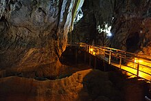

  <a href="URL_ΜΝΗΜΕΙΟΥ_1" class="geological-monument-card">
    
    

      <h3>Σπήλαιο Λιμνών</h3>
      
Μια σύντομη περιγραφή του μνημείου. Μπορείς να προσθέσεις περισσότερες λεπτομέρειες για να τραβήξεις το ενδιαφέρον του επισκέπτη.

    

  </a>
  <a href="URL_ΜΝΗΜΕΙΟΥ_2" class="geological-monument-card">
    
    

      <h3>Όνομα Μνημείου 2</h3>
      
Περιγραφή για το μνημείο, με έναν πιο απαλό και διακριτικό τρόπο.

    

  </a>

